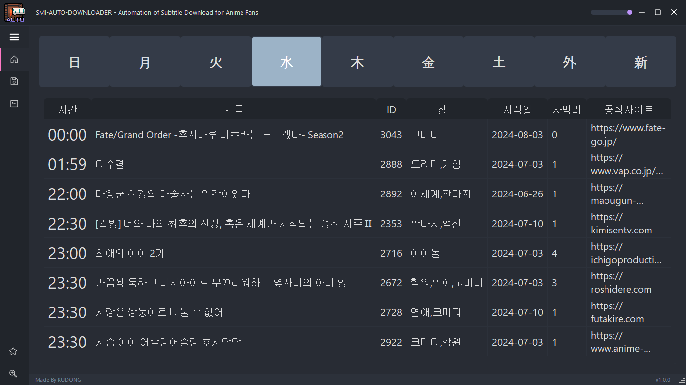
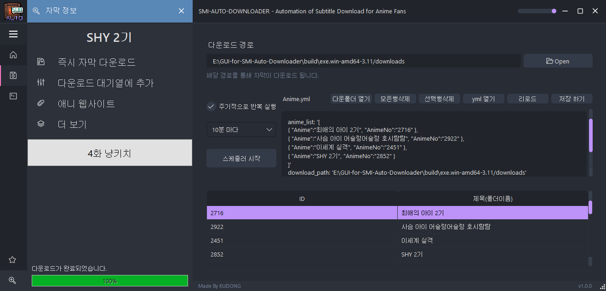
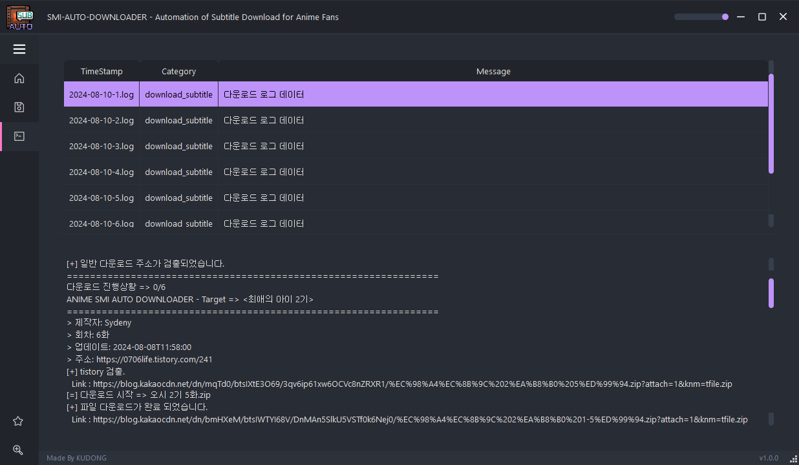

  
   

# GUI For SMI Auto Downloader

자막을 원클릭으로 쉽게 다운로드 받을 수 있는 프로그램입니다. 

[Download GUI For SMI Auto Downloader](https://github.com/dhku/GUI-for-SMI-Auto-Downloader/releases)

[Non-GUI Version Github (For NAS)](https://github.com/dhku/SMI-Auto-Downloader) 

## Features

* 애니메이션 방송 편성표 지원 (애니시아 API)
* 자막 다운로드 지원 (Naver, Tistory, BlogSpot, GoogleDrive)
* 자막 다운로드 스케줄링 지원 (주기적으로 다운로드 반복 수행)
* 백그라운드 실행 지원
* 다운로드 로깅 지원

## Usage

### 1. 편성표

* 첫 실행시 애니메이션 편성표를 확인하실 수 있습니다. 
* 작품 클릭시 **자막 정보** 탭이 확장됩니다. 

### 2. 다운로드 관리

* 첫 프로그램 실행시, 자막 다운로드 경로는 현재 디렉토리 위치의 downloads 폴더로 기본 설정됩니다. **(중요)**

  이후 프로그램 폴더 위치 변경시 자막 다운로드 경로를 직접 변경해주셔야합니다. 

  (경로 변경은 **"Open"** 버튼 클릭후 경로를 지정하시면 바로 적용됩니다. (위 사진 참조))

* 대기열에 원하는 애니메이션을 **추가**하고 싶으시다면, 자막 정보에서 **"다운로드 대기열에 추가"** 버튼 클릭 후 

  **"저장 하기"** 버튼을 반드시 클릭하셔야 적용됩니다. (위 사진 참조)

* 다운로드 대기열에서 특정 작품을 **삭제**하고 싶으시다면, 예시로 **"최애의 아이 2기"** 를 선택 후

  **"선택행 삭제"** 를 클릭한 다음에 **"저장 하기"** 버튼을 반드시 클릭하셔야 적용됩니다. (위 사진 참조)

### 3. 로그

* 다운로드 로그 데이터는 최대 30개 저장됩니다. 
* 다운로드가 수행되는 도중에는 콘솔창에 **실시간**으로 진행 사항이 업데이트 됩니다.

### 4. HiDPI 설정

* 기본 해상도 DPI는 120 입니다. (125% 배율)
* 해상도 배율을 변경하기 위해서는 settings.yml 을 열어 resolution 값을 변경합니다. (프로그램 재시작 필요)