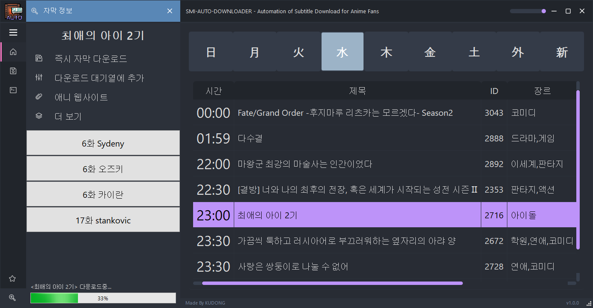

  
   

# GUI For SMI Auto Downloader

자막을 원클릭으로 쉽게 다운로드 받을 수 있는 프로그램입니다. 

[Download GUI For SMI Auto Downloader](https://github.com/dhku/GUI-for-SMI-Auto-Downloader/releases)

[Non-GUI Version Github (For NAS)](https://github.com/dhku/SMI-Auto-Downloader) 

## Features

* 애니메이션 방송 편성표 지원 (애니시아 API)
* 자막 다운로드 지원 (Naver, Tistory, BlogSpot, GoogleDrive)
* 자막 다운로드 스케줄링 지원 (주기적으로 다운로드 반복 수행)
* 백그라운드 실행 지원
* 다운로드 로깅 지원

## Caution

* 첫 프로그램 실행시, 자막 다운로드 경로가 현재 디렉토리 위치의 downloads 폴더로 기본 설정됩니다. 

  이후 프로그램 폴더 위치 변경시 자막 다운로드 경로를 직접 변경해주셔야합니다. 

  (경로 변경은 **"Open"**버튼 클릭후 경로를 지정하시면 바로 적용됩니다. (위 사진 참조))

* 스케줄러에 원하는 애니메이션을 추가하고 싶으시다면, 자막 정보에서 **"다운로드 대기열에 추가"** 버튼 클릭후 **"저장 하기"** 버튼을 반드시 클릭하셔야 적용됩니다. (위 사진 참조)

