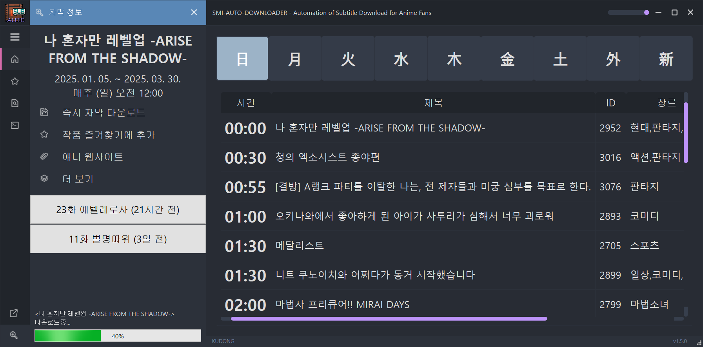
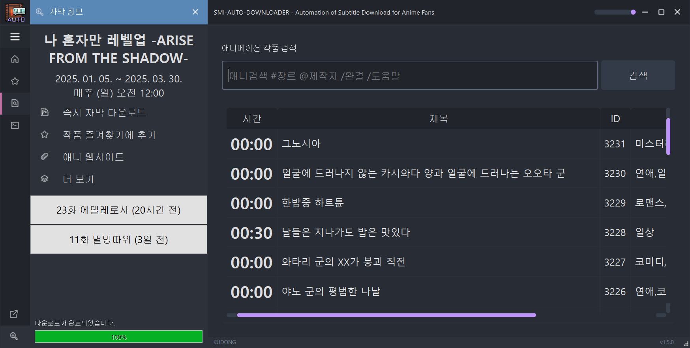
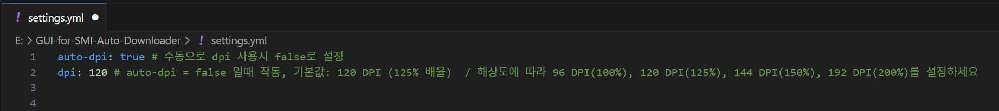

  
   

# GUI For SMI Auto Downloader

자막을 원클릭으로 쉽게 다운로드 받을 수 있는 프로그램입니다. 

[Download GUI For SMI Auto Downloader](https://github.com/dhku/GUI-for-SMI-Auto-Downloader/releases)

[Non-GUI Version Github (For NAS)](https://github.com/dhku/SMI-Auto-Downloader) 

## Features

* 애니메이션 방송 편성표 및 작품 검색 지원 (애니시아 API)
* 자막 다운로드 지원 (Naver, Tistory, BlogSpot, GoogleDrive)
* 자막 다운로드 스케줄링 지원 (주기적으로 다운로드 반복 수행)
* 백그라운드 실행 지원
* 다운로드 로깅 지원

## Usage

### 1. 편성표

* 해당 분기의 애니메이션 편성표를 확인하실 수 있습니다. 
* 작품 클릭시 **자막 정보** 탭이 확장됩니다. 

### 2. 즐겨찾기 및 다운로드 관리

* 첫 프로그램 실행시, 자막 다운로드 경로는 현재 디렉토리의 downloads 폴더로 기본 설정됩니다.

  ( 이후 프로그램 위치 변경시 다운로드 경로를 수동으로 변경해주세요. )

* 관심있는 작품이 있다면, **자막 정보**에서 "**작품 즐겨찾기에 추가**" 버튼을 누르시면 즐겨찾기 저장이 됩니다. 

  ( 즐겨찾기에 추가한 작품은 자막 일괄 다운로드 목록에도 동일하게 추가됩니다. )

* 즐겨찾기에서 특정 작품을 **삭제**하고 싶으시다면, 테이블에서 작품을 선택후 "**선택행 삭제**"를 클릭하세요.

  ( 자막 일괄 다운로드 목록에서도 작품을 제외할려면 추가로 "**저장 하기**" 버튼을 반드시 클릭하셔야 적용됩니다. )

### 3. 작품 검색

* 애니메이션 작품 검색을 지원합니다. 
* 입력창에 마우스를 대고 있으면 툴팁 자동완성 기능을 제공합니다.

### 4. 로그

* 다운로드 로그 데이터는 최대 30개 저장됩니다. 
* 다운로드가 수행되는 도중에는 콘솔창에 **실시간**으로 진행 사항이 업데이트 됩니다.

### 5. 수동 HiDPI 설정

* 기본적으로 dpi는 OS 환경에 따라 자동으로 해상도가 적용됩니다. 
* DPI를 변경하기 위해서는 settings.yml 을 열어 auto-dpi를 **false**로 설정후 dpi 값을 변경합니다. (프로그램 재시작 필요)